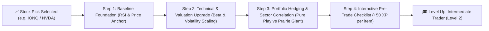
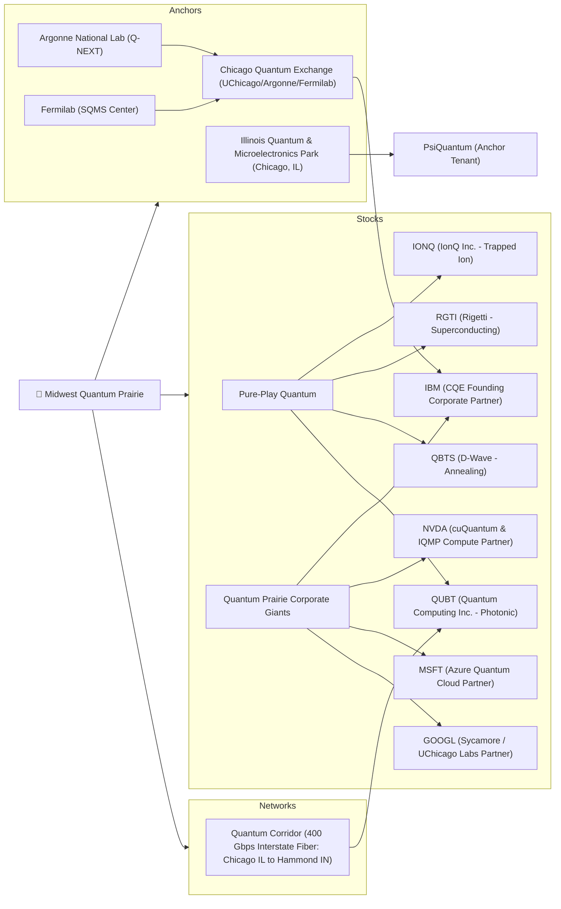
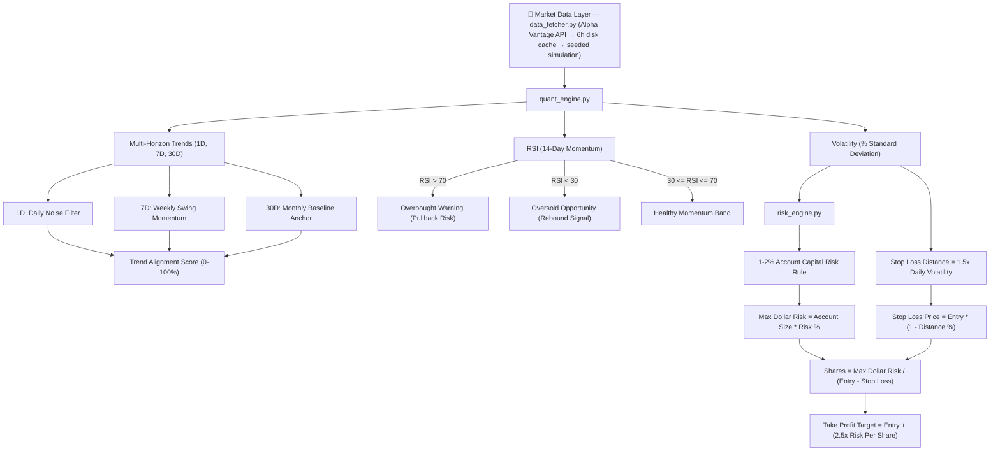

# 🧠 Knowledge Graph - RJ-Stock AI Quantum Platform

This document presents the complete structural, architectural, and domain **Knowledge Graph** for the **RJ-Stock** application, including the **Portfolio Upskilling Engine** that transitions users from beginner to intermediate stock trading skills.

---

## 🗺️ System Architecture & Data Flow Graph

```mermaid
graph TD
    User["👤 Apprentice / Intermediate Trader"] -->|Selects Ticker / Toggles Checklist / Adjusts Sliders| UI["🎨 Glassmorphic Frontend (React 19 / Vite)"]
    
    subgraph UI_Components ["Frontend UI Components (Sovereign Code/frontend/src/)"]
        UI --> TickerBar["TickerBar.jsx (Stock Feed)"]
        UI --> StockPicker["StockPicker.jsx (5-Agent Thesis & Stepped Upskill Path)"]
        UI --> RiskMgr["QuantRiskManager.jsx (Position Calculator & Risk Spotlight)"]
        UI --> PrairieHub["QuantumPrairieHub.jsx (Midwest Hub)"]
        UI --> Simulator["TradeSimulator.jsx (Order Type Literacy + Paper Ticket)"]
        UI --> Academy["TradingAcademy.jsx (Beginner & Intermediate Tracks)"]
    end

    UI -->|REST API Requests| Backend["⚡ Python Backend Server (Sovereign Code/backend/app.py)"]
    
    subgraph MultiAgent_Swarm ["5-Agent Swarm Pipeline (agents.py)"]
        Backend --> Director["👑 Trading-Director"]
        Backend --> Quant["📊 Quant-Analyst"]
        Backend --> Sentiment["🌐 Sentiment-Agent"]
        Backend --> Risk["🛡️ Risk-Manager"]
        Backend --> Execution["🎫 Execution-Agent"]
    end

    subgraph LLM_Providers ["External & Fallback AI Engines"]
        Director -->|Primary LLM| OpenAI["OpenAI GPT-4o API"]
        Director -->|Secondary LLM| Claude["Anthropic Claude 3.5 API"]
        Director -->|Offline Fallback| LocalSwarm["Local Swarm Synthesis Engine"]
    end

    subgraph Analytics_Engines ["Quant, Risk & Upskilling Engines"]
        Quant --> QuantEngine["quant_engine.py (RSI, 1D/7D/30D SMAs, Trend Alignment, Volatility, Key Levels)"]
        Risk --> RiskEngine["risk_engine.py (1-2% Capital Risk Rule, Stop Loss)"]
        Backend --> UpskillEngine["upskill_engine.py (4-Step Stock Pick Upskill Tips & Checklist)"]
    end

    subgraph MarketData_Layer ["Live Market Data Layer (data_fetcher.py)"]
        Backend --> DataFetcher["data_fetcher.py (fetch_price_history: fresh cache → Alpha Vantage → stale cache → seeded sim; warm-up thread on server start)"]
        DataFetcher -->|TIME_SERIES_DAILY| AlphaVantage["Alpha Vantage API (free tier, key in .env)"]
        DataFetcher -->|JSON cache| PriceCache["Disk Cache — Sovereign Code/data/{TICKER}_daily.json (6h TTL, stale-flagged)"]
        DataFetcher -->|offline fallback| SeededSim["Seeded Random-Walk Simulation (deterministic per ticker)"]
        DataFetcher -->|close prices + OHLC| QuantEngine
        UI -->|POST /api/refresh-data| Backend
    end

    subgraph Domain_KB ["Quantum Prairie & Stock Knowledge Base"]
        Director & PrairieHub --> PrairieDB["quantum_prairie.py (IQMP, CQE, Quantum Corridor)"]
        Director & TickerBar --> ConfigDB["config.py (Pure Play & Prairie Giant Tickers)"]
    end

    UpskillEngine -->|Stock Pick Upskill Tips| StockPicker
    Execution -->|Returns Order Ticket| Simulator
    Simulator -->|Order Type Education| User
```



---

## ⚡ Portfolio Upskilling Path (Beginner ➔ Intermediate)



---

## ⚛️ Quantum Prairie Ecosystem Knowledge Graph



---

## 📊 Technical Analysis & Risk Management Logic Graph



---

## 🔗 Entity Relationship Matrix

| Source Entity | Relationship | Target Entity | Functional Description |
| :--- | :--- | :--- | :--- |
| **`Trading-Director`** | `evaluates` | **Stock Ticker** | Generates BUY/HOLD/SELL ratings & fundamental investment thesis. |
| **`Trading-Director`** | `queries` | **OpenAI GPT-4o / Claude 3.5** | Fetches real-time LLM structured JSON reasoning. |
| **`Quant-Analyst`** | `computes` | **RSI & SMA20** | Measures price momentum and technical trend alignment. |
| **`Risk-Manager`** | `enforces` | **1-2% Risk Rule** | Restricts maximum single-trade loss to 1-2% of total account capital. |
| **`upskill_engine`** | `formulates` | **Stock Pick Tips** | Generates 4 progressive upskill steps tailored to stock volatility and Beta. |
| **`Execution-Agent`** | `creates` | **Paper Order Ticket** | Sets exact limit price, quantity, stop-loss, and take-profit targets. |
| **`Quantum Prairie Hub`** | `spotlights` | **IQMP & Quantum Corridor** | Links regional Midwest infrastructure to publicly traded stocks (`QUBT`, `IBM`, `NVDA`). |
| **`StockPicker.jsx`** | `renders` | **5-Agent & Upskill Stepper** | Displays swarm results and interactive pre-trade checklist (+50 XP per item). |
| **`TradingAcademy.jsx`**| `teaches` | **Beginner & Intermediate** | Teaches Beta hedging, RSI divergence, and ATR dynamic stop-losses. |
| **`TradeSimulator.jsx`**| `teaches` | **Order Type Literacy** | Interactive selector for Market, Limit, Stop, Stop-Limit, Trailing Stop with inline education cards (Plain English, When Pros Use It, Watch Out). |
| **`TradeSimulator.jsx`**| `adapts` | **Order Ticket Fields** | Ticket fields change per order type: Limit shows limit price, Stop shows trigger, Stop-Limit shows two prices, Trailing Stop shows trail amount + %. |
| **`QuantRiskManager.jsx`**| `recalculates` | **Position Sizing** | Dynamically computes share count & contrasts naive vs quant risk sizing. |
| **`data_fetcher.py`** | `fetches` | **Alpha Vantage API** | Pulls real OHLCV daily bars (`TIME_SERIES_DAILY`, free tier, key in `.env`). |
| **`data_fetcher.py`** | `caches` | **Disk Cache (`Sovereign Code/data/`)** | Per-ticker JSON served while fresh (6h TTL); flagged `stale: true` when past TTL. |
| **`data_fetcher.py`** | `falls back to` | **Seeded Simulation** | Deterministic OHLC random walk when API key absent, rate-limited, or offline. |
| **`POST /api/refresh-data`** | `refreshes` | **Market Data Cache** | Forces API re-fetch for one ticker or `ALL`; powers the 📡 Refresh button. |
| **`Quant-Analyst`** | `consumes` | **Live OHLCV** | RSI/SMA/Volatility/Trends from real closes; Pivot/S/R from real High/Low/Close. |

---

## 🛠️ Code Module Dependency Graph

```
Sovereign Code/
├── backend/
│   ├── app.py ─────────────► imports agents.py, quant_engine.py, risk_engine.py, upskill_engine.py, quantum_prairie.py, config.py, data_fetcher.py
│   ├── agents.py ──────────► imports quant_engine.py, risk_engine.py, upskill_engine.py, quantum_prairie.py, config.py, data_fetcher.py
│   ├── data_fetcher.py ────► Alpha Vantage API (urllib) → disk cache (Sovereign Code/data/) → seeded simulation
│   ├── upskill_engine.py ──► Stock-Specific Portfolio Upskilling Intelligence Module
│   ├── quant_engine.py ────► Standalone Math Module (OHLC-aware pivot calculation)
│   ├── risk_engine.py ─────► Standalone Risk Matrix Module
│   ├── quantum_prairie.py ─► Knowledge Base Metadata
│   └── config.py ──────────► Ticker Definitions (static metadata + offline baseline prices)
├── data/ ──────────────────► Market data cache (gitignored JSON per ticker)
└── frontend/src/
    ├── App.jsx ────────────► imports TickerBar, StockPicker, QuantRiskManager, QuantumPrairieHub, TradeSimulator, TradingAcademy
    ├── components/
    │   ├── TickerBar.jsx
    │   ├── StockPicker.jsx       (Includes Interactive Pre-Trade Checklist & Mastery Progress)
    │   ├── QuantRiskManager.jsx  (Includes Risk Upskill Spotlight Widget)
    │   ├── QuantumPrairieHub.jsx
    │   ├── TradeSimulator.jsx    (Order Type Literacy: 5 order types + inline education cards)
    │   └── TradingAcademy.jsx    (Includes Beginner Foundations & Intermediate Mastery tracks)
    └── index.css ──────────► Design Tokens, Upskill Stepper, Order Type Selector & Glassmorphism System
```
